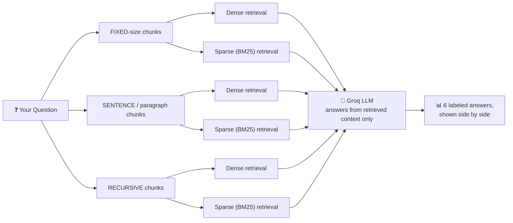

<div align="center">

# 🤖 AI Season RAG Chatbot

**A single-file RAG backend that runs 3 chunking methods × 2 retrieval techniques = 6 pipelines side by side on the same query — so you can actually *see* how each design choice changes the answer.**

[](https://www.python.org/)
[](https://streamlit.io/)
[](https://groq.com/)
[](#-license)
[](#)

[Overview](#-overview) • [How It Works](#-how-it-works) • [Setup](#-setup) • [Run It](#-run-it) • [What to Try](#-what-to-look-for-when-testing) • [Design Notes](#-design-notes)

</div>

---

## 📖 Overview

This is my first RAG chatbot project, built for **AI Season** — an Agentic AI bootcamp led by Abdul Rehman Azam. Task 3 of the bootcamp asked for a chatbot that doesn't just *answer* — it exposes **how** it answers, by comparing multiple retrieval strategies against each other on the same question, at the same time.

The knowledge base is the AI Season bootcamp's own document, and every query is run through **all 6 pipeline combinations simultaneously**, each one clearly labeled:

| ✅ Requirement | Status |
|---|---|
| Simple RAG chatbot | Done |
| Uses the AI Season document as knowledge base | Done |
| 3 chunking methods (fixed-size, sentence/paragraph, recursive) | Done |
| 2 retrieval techniques (dense vector similarity, sparse BM25) | Done |
| All 6 outputs shown together for one query | Done |
| Each output clearly labeled by method + technique | Done |

---

## 🧩 How It Works



Each chunking method gets its **own** vector collection and its **own** BM25 index — chunk sets are never mixed between methods, so what you're comparing is genuinely apples-to-apples on retrieval technique, not contaminated by a shared index.

---

## 🧰 Tech Stack

| Layer | Tools |
|---|---|
| Chunking | Fixed-size, sentence/paragraph-based, recursive |
| Dense retrieval | Vector similarity search |
| Sparse retrieval | BM25 keyword search |
| LLM | Groq (swappable to a mock provider for offline testing) |
| Frontend | Streamlit |

---

## ⚙️ Setup

<details open>
<summary><b>1. Install dependencies</b></summary>

You likely already have most packages if you've done an earlier RAG project — in your existing (or a fresh) venv:

```bash
pip install -r requirements.txt
```
</details>

<details open>
<summary><b>2. Configure your environment</b></summary>

```powershell
Copy-Item .env.example .env      # Windows PowerShell
# or: cp .env.example .env       # Mac/Linux
```

Edit `.env` and add your real Groq key:

```env
LLM_PROVIDER=groq
GROQ_API_KEY=gsk_your_real_key_here
```

> 💡 **No key yet?** Set `LLM_PROVIDER=mock` instead — this lets you verify chunking/retrieval behavior without spending API calls or needing a key at all.
</details>

<details open>
<summary><b>3. Confirm the knowledge base is present</b></summary>

Make sure `data/aiseason-document.txt` exists — it ships with the repo, so this should already be there.
</details>

---

## 🚀 Run It

### Command-line version
```bash
python rag_chatbot.py
```
Type `exit` to quit.

### 🖥️ Frontend (recommended)
```bash
streamlit run app.py
```
Opens in your browser. It imports all pipeline logic directly from `rag_chatbot.py` — zero duplicated logic between the CLI and the UI. You get:

- 🎛️ **Sidebar status panel** — mock/live mode, embedding model, current chunk sizes, and a **"Rebuild knowledge base"** button (use after editing the source document — wipes and rebuilds all 6 indexes).
- 📋 **Quick-glance comparison table** at the top of every query — method, retrieval technique, chunks retrieved, and an answer preview, one scannable row per pipeline.
- 🔍 **Detailed cards below**, grouped by chunking method, dense vs. sparse shown side by side so you can directly compare how the *same* chunk set behaves under two retrieval techniques.
- 📂 Each card has an expandable **"Retrieved N chunk(s)"** section — exactly what was fed to the LLM, useful for explaining *why* an answer came out the way it did.
- 🕓 A running **session history** of every query you've asked, most recent first.

**Example:**
```
Your question: What is the price of AI Season and who teaches it?
```
produces all 6 labeled outputs:
```
[chunking=FIXED      |  retrieval=DENSE]
[chunking=FIXED      |  retrieval=SPARSE]
[chunking=SENTENCE   |  retrieval=DENSE]
[chunking=SENTENCE   |  retrieval=SPARSE]
[chunking=RECURSIVE  |  retrieval=DENSE]
[chunking=RECURSIVE  |  retrieval=SPARSE]
```
each with its retrieved chunk previews *and* the generated answer.

---

## 🔍 What to Look For When Testing

Useful queries for spotting real differences between the 6 pipelines (great material for a report):

| Query | What to watch for |
|---|---|
| *"What is the price of AI Season?"* | A specific number — does **SPARSE (BM25)** surface it more reliably than DENSE, since BM25 is strong on exact numeric/keyword matches? |
| *"Who is the founder and what is his background?"* | Descriptive & paraphrasable — **DENSE** tends to win here since it matches on meaning, not exact wording. |
| *"What is AI Season's mission statement?"* | Appears verbatim multiple times — does **FIXED-size** chunking split the quote awkwardly across two chunks, vs. SENTENCE/RECURSIVE keeping it intact? |
| *"Does AI Season offer a scholarship for international students?"* (not in the doc) | All 6 pipelines should say *"I don't have enough information"* — not hallucinate. |

---

## 🗒️ Design Notes

- Every chunking method has its **own** vector collection and **own** BM25 index — no chunk-set mixing.
- All indexes rebuild fresh on every run — no stale/leftover chunks, keeping behavior predictable across repeated tests.
- **Mock mode** (`LLM_PROVIDER=mock`) exists specifically so retrieval can be verified in isolation, without an API key or cost — handy while debugging chunking behavior.

---

## 👤 Author

**Mahandar Khatri** — BSCS student, FAST-NUCES Karachi
[GitHub @mk-2007](https://github.com/mk-2007) · [Codeforces @_gazzy284](https://codeforces.com/profile/_gazzy284)

Built for **AI Season**, an Agentic AI bootcamp led by Abdul Rehman Azam.

## 📄 License

**All Rights Reserved.** This code is public for portfolio/demonstration purposes only — viewing is fine, but copying, modifying, or redistributing it requires written permission from the author.
